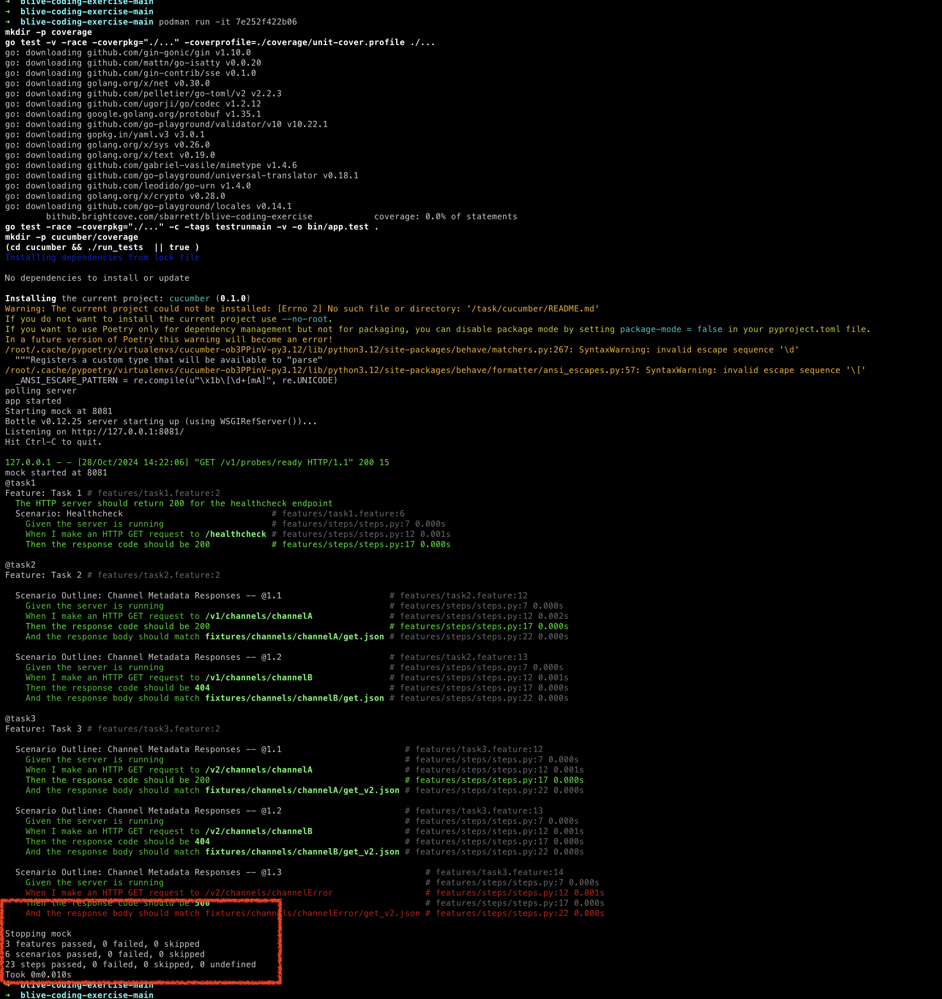

# blive-coding-exercise

## Task 1

Write a basic HTTP web server which simply returns 200 OK on requests to `/healthcheck` 

## Task 2

Extend this server to return metadata about live channels from files stored on disk.

Write an endpoint `/v1/channels/{channel_id}` which returns json stored in `data/channels/<channel_id>.json`. If the file does not exist, return a 404.

## Task 3

Extend this server to enrich the metadata with additional information from the Blive API.

Write an endpoint `/v2/channels/{channel_id}` which returns json stored in `data/channels/<channel_id>.json` with the ingest point and playback point added based on the Blive API.
- If the file does not exist, return a 404.
- If the Blive API returns an error, return a 500.

## Solution:
Please find below the steps to run the container to test it. 
1. Install podman using the instructions mentioned here https://medium.com/@androidify.mayank/running-postgres-using-podman-on-mac-94135753083e
2. Follow the steps of above doc until step 2 (in the doc) which is to run the podman virtual machine for mac.
3. If you have a docker compose file, you can use podman compose as a which is a thin wrapper around
   an external compose provider such as docker-compose or podman-compose.
4. In our case, we don't need step 3 as we don't have compose files and as podman can directly work with Dockerfile. [Note : **Some context - Podman is compatible with the Docker CLI, and it supports most of the same commands, including building images from Dockerfile.
Since both use the OCI (Open Container Initiative) standards, Podman can interpret and execute the instructions in a Dockerfile the same way Docker does.**]
5. Run command `podman build -t blive_webserver .` to build the container image.(Make sure you are inside the project dir having `Dockerfile`)
6. Run command `podman run -it --name <container_name> <image_name>` (this will start the container.). [Note : You can obtain the image_id by running the command as `podman images`]
7. As you can see `Dockerfile` the entrypoint command specifies to run `just test` as the default command which runs a series of tasks defined in `Justfile`

NOTE : You don't need podman to build the image and run container,
if you have docker installed then that should also work and results of running tests should be same.

## Please find below the running status of the bdd tests

